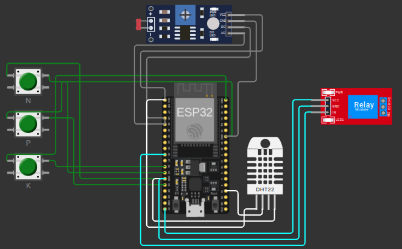

# FIAP - Faculdade de Informática e Administração Paulista

<p align="center">
<a href="https://www.fiap.com.br/"></a>
</p>

<br>

# Farm Tech — Sistema de Irrigação Inteligente (Fase 2)

## 👨‍🎓 Integrantes:

- Henrique Sanches Silva - RM570527
- Luís Henrique Laurentino Boschi - 571352
- Kayck Gabriel Evangelista da Silva - 572331
- Patrick Borges de Melo - 574030

## 👩‍🏫 Professores:

### Tutor(a)

- Sabrina Otoni

### Coordenador(a)

- André Godoi Chiovato

## 📜 Descrição

Dando continuidade ao projeto Farm Tech, a Fase 2 avança da camada de gestão de insumos para a camada de **sensoriamento e automação em campo**. A proposta agora é construir e simular um dispositivo eletrônico capaz de coletar dados de uma lavoura em tempo real e tomar decisões automáticas de irrigação, representando o próximo passo da FarmTech Solutions rumo a uma fazenda inteligente.

O projeto foi desenvolvido no simulador [Wokwi.com](https://wokwi.com/) utilizando um microcontrolador **ESP32** e sensores que representam, de forma didática, os principais indicadores agronômicos de uma cultura. Como o Wokwi não disponibiliza sensores exclusivamente agrícolas, foram aplicadas as substituições sugeridas no enunciado:

| Grandeza real               | Sensor/atuador usado no Wokwi | Justificativa                                                |
| --------------------------- | ----------------------------- | ------------------------------------------------------------ |
| Nível de **Nitrogênio (N)** | Botão verde (`btn1`)          | Leitura binária: pressionado = nutriente presente            |
| Nível de **Fósforo (P)**    | Botão verde (`btn2`)          | Leitura binária: pressionado = nutriente presente            |
| Nível de **Potássio (K)**   | Botão verde (`btn3`)          | Leitura binária: pressionado = nutriente presente            |
| **pH do solo**              | Sensor LDR (fotorresistor)    | Valor analógico 0–4095 mapeado para escala de pH 0–14        |
| **Umidade do solo**         | Sensor DHT22                  | Sensor de umidade do ar usado como proxy da umidade do solo  |
| **Bomba d'água**            | Módulo relé azul              | Acionada pelo ESP32 conforme a lógica de decisão por cultura |

O ESP32 coleta as leituras periodicamente, aplica a **regra de decisão da cultura selecionada** pelo usuário e aciona (ou não) o relé que representa a bomba de irrigação. A cultura é escolhida pelo operador via Monitor Serial, e o sistema também aceita um comando manual para simular **previsão de chuva**, suspendendo a irrigação mesmo que o solo esteja seco.

## 🎯 Problema tratado no agronegócio

Otimização do uso da água e dos nutrientes na lavoura, reduzindo desperdício de recursos hídricos, evitando estresse hídrico da planta e apoiando a produtividade com decisões automáticas baseadas em dados de solo e clima.

## ✅ Funcionalidades implementadas

- **Monitoramento em tempo real** de NPK (via botões), pH (via LDR) e umidade do solo (via DHT22).
- **Seleção de cultura** pelo Monitor Serial, com parâmetros próprios (pH ideal, umidade mínima, nutrientes críticos) para **Milho** e **Café**.
- **Controle automático da bomba** (relé) com lógica de decisão combinando umidade, pH, nutrientes e previsão de chuva.
- **Override manual de chuva** via comando Serial (`C` liga / `S` desliga) para simular a integração com dados meteorológicos.
- **Mapeamento do LDR** para a escala didática de pH de 0 a 14, com saturação nos limites.
- **Status detalhado no Monitor Serial** a cada ciclo, exibindo leituras dos sensores e o motivo quando a bomba está desligada (umidade adequada, pH fora da faixa, nutrientes insuficientes, chuva prevista).
- **Proteção contra leitura inválida** do DHT22 (tratamento de `NaN`).
- **Uso de `INPUT_PULLUP`** nos botões para leitura estável sem resistores externos.

### 🌱 Culturas suportadas

O sistema já vem configurado com duas culturas, cada uma com sua faixa ideal de pH, umidade mínima aceitável e nutrientes críticos:

| Cultura | pH ideal  | Umidade mínima | Nutrientes críticos |
| ------- | --------- | -------------- | ------------------- |
| Milho   | 5.5 – 7.0 | 60%            | N, P, K             |
| Café    | 5.0 – 6.5 | 65%            | N                   |

### 🧠 Lógica de decisão da bomba

A bomba é **ligada** somente quando **todas** as condições abaixo são verdadeiras:

1. A umidade lida pelo DHT22 está **abaixo** da umidade mínima da cultura (solo seco).
2. O pH simulado (vindo do LDR) está **dentro** da faixa ideal da cultura.
3. Todos os nutrientes críticos da cultura estão presentes (botões correspondentes pressionados).
4. Não há **previsão de chuva** ativada via comando Serial.

Caso qualquer uma dessas condições falhe, a bomba permanece desligada e o Monitor Serial exibe o motivo.

## 📁 Estrutura de pastas

Dentre os arquivos e pastas presentes na raiz do projeto, definem-se:

- <b>assets</b>: arquivos estáticos do repositório, como a imagem do circuito montado no Wokwi.
- <b>src</b>: código-fonte do ESP32 (`sketch.ino`), definição do circuito (`diagram.json`), bibliotecas utilizadas (`libraries.txt`) e link do projeto no Wokwi (`wokwi-project.txt`).
- <b>README.md</b>: documentação principal do projeto.

## 📚 Conteúdos da disciplina aplicados

| Capítulo | Conteúdo                                                     | Aplicação no projeto                                                                                       |
| -------- | ------------------------------------------------------------ | ---------------------------------------------------------------------------------------------------------- |
| Cap 9    | Chamando todas as placas — ESP32, Arduino IDE e Wokwi        | Projeto inteiro montado no Wokwi usando placa ESP32 DevKit-C v4 e programado em C/C++                      |
| Cap 10   | A Eletrônica de uma IA — sensores, atuadores e circuitos     | Uso de botões com `INPUT_PULLUP`, leitura analógica do LDR, leitura digital do DHT22 e acionamento de relé |
| Cap 3    | Pensamento computacional e lógica de decisão                 | Estrutura de `struct`, funções com parâmetros e cadeia de condições para a regra de irrigação              |
| Cap 4    | Ferramenta do futuro: Python → extensão para C/C++ embarcado | Tradução da lógica de decisão para C/C++, com tipagem explícita e uso de `bool`, `float`, `int`            |

## 🔌 Mapeamento de pinos do ESP32

| Componente      | Pino do ESP32 | Modo             |
| --------------- | ------------- | ---------------- |
| Botão N         | GPIO 12       | `INPUT_PULLUP`   |
| Botão P         | GPIO 13       | `INPUT_PULLUP`   |
| Botão K         | GPIO 14       | `INPUT_PULLUP`   |
| LDR (pH)        | GPIO 34       | `analogRead`     |
| DHT22 (umidade) | GPIO 15       | Digital / DHTesp |
| Relé (bomba)    | GPIO 26       | `OUTPUT`         |

## 🖼️ Circuito no Wokwi



## 🔧 Como executar o código

### Pré-requisitos

- Conta gratuita no [Wokwi.com](https://wokwi.com/) (opcional, apenas para salvar o projeto).
- Navegador atualizado (Chrome, Edge ou Firefox).
- Biblioteca `DHT sensor library for ESPx` (adicionada pelo gerenciador de bibliotecas do Wokwi).

### Passo a passo

1. Acessar o projeto pelo link contido em `src/wokwi-project.txt`, **ou** criar um novo projeto ESP32 no Wokwi e substituir os arquivos:
   - Copiar o conteúdo de `src/sketch.ino` para o editor de código.
   - Copiar o conteúdo de `src/diagram.json` para a aba `diagram.json`.
   - Na aba **Libraries**, adicionar a biblioteca listada em `src/libraries.txt`:

     ```
     DHT sensor library for ESPx
     ```

2. Clicar em **"Start the simulation"** (botão verde de play).

3. Abrir o **Serial Monitor** (ícone do terminal na parte inferior) configurado em **115200 baud**.

4. No Monitor Serial, **selecionar a cultura**:
   - Digite `1` e pressione Enter → **Milho**
   - Digite `2` e pressione Enter → **Café**

5. Interagir com o circuito:
   - **Pressionar os botões N, P, K** para simular a presença de cada nutriente no solo.
   - **Clicar no LDR** e ajustar a intensidade de luz (altera o pH simulado de 0 a 14).
   - **Clicar no DHT22** e ajustar a umidade (abaixo do mínimo da cultura → bomba liga; acima → bomba desliga).

6. (Opcional) Simular previsão de chuva pelo Monitor Serial:
   - Digite `C` → chuva prevista **ligada** (bomba fica desligada mesmo com solo seco).
   - Digite `S` → chuva prevista **desligada** (volta ao modo automático).

7. Observar a decisão da bomba a cada 3 segundos no Monitor Serial, incluindo o motivo quando a bomba estiver desligada.

## 🎥 Vídeo demonstrativo

Demonstração completa do funcionamento do projeto (até 5 minutos, vídeo não listado no YouTube):

**🔗 [replace_link_youtube](replace_link_youtube)**

## 📋 Licença

<p xmlns:cc="http://creativecommons.org/ns#" xmlns:dct="http://purl.org/dc/terms/"><a property="dct:title" rel="cc:attributionURL" href="https://github.com/agodoi/template">MODELO GIT FIAP</a> por <a rel="cc:attributionURL dct:creator" property="cc:attributionName" href="https://fiap.com.br">FIAP</a> está licenciado sob <a href="http://creativecommons.org/licenses/by/4.0/?ref=chooser-v1" target="_blank" rel="license noopener noreferrer" style="display:inline-block;">Attribution 4.0 International</a>.</p>
